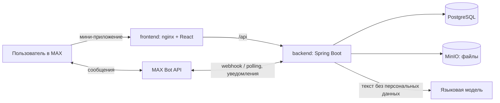

# Согласование документов в MAX

Хакатон MAX × Минобрнауки России, трек «Эффективный бизнес», команда **Сибирский Вайб**

Чат-бот `@t354_hakaton_max_bot` с мини-приложением в MAX: сотрудник загружает документ, сервис до отправки находит
ошибки оформления, автор видит и правит маршрут согласующих, каждый согласующий получает сообщение в MAX, когда
подходит его очередь. Решение по документу всегда принимает человек — модель не решает ничего.

**Открыть в MAX:** https://max.ru/t354_hakaton_max_bot — бот «Хакатон МАХ 354», кнопка «Открыть мини-приложение».
Проверить весь сценарий в одиночку за 10 минут — [раздел 13](#13-пошаговый-сценарий-проверки).

Разделы README идут в порядке «Формата сдачи» кейса.

---

## 1. Назначение решения

Автор загружает документ (DOCX или PDF). ИИ определяет вид документа и извлекает из текста поля, а обычный код
сверяет их с правилами: у каждого замечания — важность и основание (ГОСТ, правило компании, закон). Документ идёт по
маршруту согласующих с уведомлениями в боте; решение «согласовать / вернуть на доработку / отклонить» принимает
человек.

**Проблема.** Сотрудник малого или среднего предприятия, готовящий документ, который должен пройти нескольких
согласующих, хочет получить согласованный документ в предсказуемый срок. Но процесс живёт в переписке: маршрут
нигде не зафиксирован, статус не виден, а ошибки вскрываются на последнем шаге — документ возвращается на доработку,
и цикл повторяется заново.

Что это подтверждает:
- 38% работников тратят более 6 часов в неделю на согласование документов, заявок и запросов (hh.ru, опрос
  5–12 мая 2025, 3 283 респондента);
- полностью электронный документооборот — только у каждой десятой компании, хотя 73% предпринимателей уже
  применяют электронные документы и подпись (исследование сервиса «Моё дело»);
- 33% останавливает привязка ЭДО к компьютеру и физическому токену (там же) — решение должно работать с телефона и
  без установки, это даёт MAX.

**Целевой пользователь.** Компании малого и среднего бизнеса на 15–250 человек, где уже сложились роли (юрист,
бухгалтер, руководитель), но выделенной системы документооборота нет. Основной пользователь — автор документа: он
отвечает за срок и несёт всю боль возвратов. Второй — согласующий: юрист, бухгалтер, руководитель.

## 2. Основной пользовательский сценарий

От подключения компании до итогового статуса:

0. **Подключение компании.** Администратор создаёт компанию (название и часовой пояс — по нему считается «сегодня») и
   делится кодом или ссылкой. Сотрудник по общему коду подаёт заявку, администратор принимает её и назначает роли.
   По личной ссылке с заранее выбранными ролями человек вступает сразу, без заявки.
1. **Вход.** Мини-приложение открывается из бота. Личность — из подписанных данных запуска MAX, роли — назначенные
   администратором; сам пользователь ничего не выбирает.
2. **Загрузка.** «Новый документ» → файл. Вид документа по умолчанию определяет ИИ.
3. **Проверка.** Замечания со ссылкой на правило и основанием — или «Замечаний нет». Критичные замечания не дают
   отправить документ. Поле из DOCX можно исправить прямо в файле — получится новая версия, проверенная заново.
4. **Маршрут.** Автор видит всю цепочку с именами: этапы идут по очереди, люди внутри этапа согласуют одновременно,
   последним — утверждающий. Порядок и состав можно менять, обязательных (с замком) убрать нельзя.
5. **Решения.** Согласующий получает сообщение в боте с кнопкой «Открыть документ» и решает в мини-приложении. Если
   решение затягивается дольше двух суток, бот напоминает (настройки `REMINDERS_*`).
6. **Итог.** После последнего решения — «Согласован» или «Утверждён» (если был этап утверждения), автору приходит
   уведомление. Возвращённый документ автор исправляет и отправляет заново; если он не менялся, прежние согласования
   сохраняются.

## 3. Состав и архитектура решения

| Компонент | Технология | Назначение |
|---|---|---|
| `backend` | Java 21, Spring Boot 3.5.16 | REST для мини-приложения, состояния документа и маршрут, Bot API, ИИ-пайплайн, правила |
| `frontend` | React 19, Vite 7, `@maxhub/max-ui` | Мини-приложение MAX; nginx раздаёт статику и проксирует `/api` на бэкенд |
| `postgres` | PostgreSQL 16 | Метаданные: компании, пользователи, документы, версии, маршруты, решения, правила |
| `minio` | MinIO (S3-совместимое) | Файлы документов. В БД только `storage_key` |
| Языковая модель | внешний HTTPS-сервис, в MVP — GigaChat | Вид документа, поля и краткая сводка из текста. Нарушено ли правило, решает код |
| MAX Bot API | внешний HTTPS-сервис | Уведомления, вход в мини-приложение, ссылки-приглашения |



Путь документа: файл → текст → маскирование персональных данных → модель (поля) → движок правил (замечания).
Модель только переводит текст в поля; нарушено ли требование, решает обычный код по правилам из базы. Поэтому
проверка воспроизводима, покрыта тестами и работает, даже когда модель недоступна.

Модель не зашита в продукт. Доменный код обращается к ней через два порта — «определить вид документа» и «найти
поля», — а конкретный сервис подключается отдельным адаптером. В MVP это GigaChat: российский поставщик, данные
обрабатываются в России, есть готовый коннектор для Spring AI. YandexGPT, OpenAI-совместимый сервис или модель
в контуре заказчика подключаются новым адаптером, без изменений в правилах, маршрутах и интерфейсе.

Модули бэкенда, модель данных и переходы статусов — [docs/ARCHITECTURE.md](docs/ARCHITECTURE.md), эндпоинты —
[docs/API_CONTRACTS.md](docs/API_CONTRACTS.md), правила проверки с источниками — [docs/RULES.md](docs/RULES.md).

Собственного API для внешних систем решение не предоставляет: REST бэкенда — внутренний, для мини-приложения, и
принимает только запросы с подписанными данными запуска MAX.

## 4. Запуск: одна команда

```bash
cp .env.example .env && docker compose up --build
```

Перед запуском заполните в `.env` обязательные параметры (раздел 5). После старта:

- Мини-приложение — http://localhost:8081
- API бэкенда — http://localhost:8080 (состояние — `/actuator/health`)

Базовые образы скачиваются с `public.ecr.aws` и закреплены по digest. Если реестр недоступен или ограничил трафик,
те же образы берутся с зеркала Docker Hub: `BASE_REGISTRY=mirror.gcr.io/library docker compose up --build`
(или строка `BASE_REGISTRY` в `.env`).

Сборка укладывается в лимит кейса в 5 минут: полная пересборка без кэша на финальной версии — **151 с** (замер
30.09.2026, без учёта первоначальной загрузки базовых образов). Все сервисы поднимаются в состояние `healthy`, бакет MinIO создаётся автоматически.

> **Контейнеры — для воспроизводимой проверки кода, а не для прохождения сценария.** Мини-приложение принимает
> только подписанные данные запуска MAX: открытое в обычном браузере по `localhost:8081`, оно покажет «Не удалось
> подтвердить вход через MAX». Внутри MAX мини-приложение открывается только по адресу, который организаторы
> зарегистрировали для нашего бота. Рабочая версия — в MAX, ссылка на бота — на первом слайде презентации,
> сценарий — в разделе 13.

## 5. Необходимые параметры окружения

| Параметр | Обязателен | Назначение |
|---|---|---|
| `DB_PASSWORD` | да | Пароль Postgres. Без него compose не стартует |
| `MINIO_ACCESS_KEY` | да | Ключ доступа MinIO (≥ 3 символов). Без него compose не стартует |
| `MINIO_SECRET_KEY` | да | Секрет MinIO (≥ 8 символов). Без него compose не стартует |
| `MAX_BOT_TOKEN` | для работы в MAX | Токен чат-бота, выдаётся организаторами. Без него бэкенд стартует, но уведомления не отправляются |
| `MAX_MINI_APP_URL` | для работы в MAX | Публичный HTTPS-адрес мини-приложения — для кнопок и ссылок-приглашений |
| `MAX_BOT_UPDATE_MODE` | нет | `polling` (по умолчанию, локально) или `webhook` (стенд, нужны `MAX_BOT_WEBHOOK_URL` и `MAX_BOT_WEBHOOK_SECRET`) |
| `GIGACHAT_CREDENTIALS` | нет | Authorization key GigaChat — языковой модели MVP. Без него поля вводятся вручную (раздел 12) |
| `GIGACHAT_CLIENT_ID` | нет | Идентификатор проекта GigaChat; секрет уже входит в Authorization key |
| `GIGACHAT_MODEL` | нет | Модель извлечения полей; по умолчанию `GigaChat-2-Max` |
| `DEMO_MODE` | нет | `true` включает демонстрацию для проверки (раздел 10) |

## 6. Переменные окружения

Полный список с комментариями — в [`.env.example`](.env.example): кроме параметров выше, там `AI_ENABLED`,
`AI_TIMEOUT_SECONDS`, `REMINDERS_*` (напоминания о застрявшем шаге), `MAX_BOT_ENABLED`, `DOWNLOAD_LINK_SECRET`,
порты хоста. Реальных значений в репозитории нет: рабочие токены передаются только на служебном первом слайде
презентации.

## 7. Используемые порты

| Порт | Сервис | Доступен с хоста |
|---|---|---|
| 8081 | frontend (nginx) | да, на `127.0.0.1` |
| 8080 | backend | да, на `127.0.0.1` |
| 5432 | postgres | нет, только внутри сети compose |
| 9000 | minio (S3 API) | нет |
| 9001 | minio (консоль) | нет |

Порты хоста переопределяются через `BACKEND_PORT` и `FRONTEND_PORT`. Наружу (HTTPS) на стенде их публикует
обратный прокси.

## 8. Зависимости

Зафиксированы с точными версиями:

- **Backend** — [`backend/pom.xml`](backend/pom.xml). Spring Boot 3.5.16, Spring AI 1.1.2,
  `chat.giga:spring-ai-starter-model-gigachat:1.1.2` (Apache-2.0), MinIO client 8.5.17, Apache PDFBox 3.0.8
  (Apache-2.0). DOCX читается средствами JDK (это zip с XML), без Apache POI.
- **Frontend** — [`frontend/package.json`](frontend/package.json) + `package-lock.json`. React 19.2.8,
  `@maxhub/max-ui` 0.5.0 (MIT), Vite 7.

Требования к среде разработки: **JDK 21**, **Node.js 22 LTS** (Vite 7 не работает на Node < 20.19). Корневой
сертификат Минцифры, нужный для GigaChat и MAX Bot API, встроен в образ бэкенда (`backend/certs`); для запуска из IDE без
Docker его нужно добавить в хранилище сертификатов JDK.

## 9. Внешние сервисы и интеграции

| Сервис | Воспроизводим в Docker | Назначение | Условия проверки |
|---|---|---|---|
| **Языковая модель** (в MVP — GigaChat API) | нет | Вид документа, поля и краткая сводка из текста. Замечания формирует движок правил, не модель | Нужен `GIGACHAT_CREDENTIALS`. Рабочий ключ — на первом слайде презентации. Без ключа сценарий проходится полностью, см. раздел 12 |
| **Платформа MAX**: Bot API и MAX Bridge | нет | Бот: уведомления, вход в мини-приложение, ссылки-приглашения. Bridge (`st.max.ru/js/max-web-app.js`): подписанные данные запуска, скачивание файлов | Нужен `MAX_BOT_TOKEN`, выдаётся организаторами. Мини-приложение открывается внутри MAX только по адресу, зарегистрированному организаторами, поэтому сценарий проверяется на нашем стенде |

Других внешних интеграций нет. Живого подключения к государственным информационным системам в решении **нет** —
см. раздел 11.

## 10. Порядок работы с тестовыми данными

**Демонстрация (`DEMO_MODE=true`, на стенде включена).** Основной сценарий требует нескольких людей с разными
ролями. Чтобы один проверяющий прошёл цепочку целиком, кнопка «Посмотреть демонстрацию» создаёт **его личную копию**
демо-компании, а полоса вверху экрана переключает, от имени какого участника он действует. Каждый проверяющий
работает в своей копии, чужие действия её не меняют. Это **механизм проверки, а не часть продукта**: он включается
переменной окружения, в рабочем режиме выключен и никогда не даёт действовать от имени участника настоящей компании.
Реальный путь — идентификация пользователя средствами MAX.

Что в демо-компании:

| Участник | Роль |
|---|---|
| Демо Автор | Руководитель отдела — с него начинается демонстрация |
| Демо Юрист | Юрист |
| Демо Бухгалтер | Бухгалтер |
| Демо Директор | Директор — утверждает |
| Демо Администратор | Кадровик, права администратора |
| Демо Кандидат | Не участник: его заявка на вступление ждёт решения администратора |

- Документы: пять служебных записок в разных состояниях — черновик, на согласовании, утверждённая, возвращённая на
  доработку, отклонённая.
- Виды документов и маршруты по умолчанию: служебная записка, заявление на отпуск, заявка на меру поддержки, заявка
  на командировку и «Другой документ» — для любого другого файла.
- Правила проверки — шаблон сервиса; у демо-компании часть правил уже настроена под её «Инструкцию по
  делопроизводству» и «Положение об отпусках», чтобы было видно «Изменено компанией».
- Часовой пояс — по устройству, на котором открыли демонстрацию (пояс не российский — Москва).

Вернуть демонстрацию к началу: полоса вверху → «Начать заново» или «Компания» → «Демонстрационный режим» →
«Начать заново».

**Тестовые файлы** — [`testdata/documents`](testdata/documents): на каждый поддержанный вид — чистый документ и
документы с ошибками, плюс приказ, акт и письмо для «Другого документа». Что в каждом и какие правила обязаны сработать —
[testdata/README.md](testdata/README.md) и [docs/RULES.md](docs/RULES.md). Все имена, организации и реквизиты
вымышлены.

## 11. Описание работы с данными

- **Файлы документов** — в MinIO. В Postgres хранится только `storage_key`, бинарники в БД не попадают.
- **Метаданные и результаты ИИ** — в Postgres. Возврат на доработку создаёт новую версию, а не затирает старую;
  каждое решение согласующего привязано к версии.
- **Доступ** фильтруется по роли и организации **до** обращения к модели и **до** отдачи данных в интерфейс.
  Личность — только из проверенной подписи данных запуска MAX, никогда из тела запроса.
- **Маскирование персональных данных.** ИНН, СНИЛС, паспорт, телефон и ФИО заменяются именованными метками
  (`<INN_1>`, `<PERSON_1>`) регулярными выражениями **перед** отправкой в модель; реальные значения подставляются
  обратно локально при показе. В модель уходит текст, а не файл.
- **Флаг «Содержит чувствительные данные».** Если автор его выставил, текст не уходит в модель вообще: автор
  заполняет поля вручную, проверка идёт по введённым значениям.
- **Сканы без текста** в модель не отправляются (изображение нельзя замаскировать): приложение сообщает, что текста
  в файле нет, поля вводятся вручную.
- **Привязка к источнику.** Каждое замечание порождено конкретным правилом (`rule_id`) с основанием, а не является
  свободным текстом модели.

**Правила проверки: шаблон и настройки компании.** Справочник правил (`requirement_rule`) — шаблон сервиса,
одинаковый для всех компаний; полный список с источниками — [docs/RULES.md](docs/RULES.md). Компания хранит только
отличия от шаблона (`organization_rule_setting`, по одной строке на изменённое правило), правила не копируются:
- администратор в «Компания» → «Правила проверки» выключает правило, меняет важность, текст замечания и
  документ-основание с пунктом, а у проверок «Не короче» и «Одно из значений» — ожидаемое значение;
- правила вида «Закон» не выключаются и не меняются: закон одинаков для всех. Шаблоны формата и формат даты
  не открываются — ошибка в них молча ломала бы проверку;
- рекомендация сервиса, которой компания указала свой документ, становится правилом компании;
- замечания — снимок на момент проверки. Изменённые правила действуют на новые проверки; черновик или
  возвращённый документ автор перепроверяет кнопкой «Проверить заново» — по сохранённым полям, без модели;
  документы на согласовании не пересчитываются.

**Часовой пояс компании.** «Сегодня» в правиле «Дата не в будущем», в периодах списков и в показателях считается по
часовому поясу компании — его выбирают при создании компании и меняет администратор в разделе «Компания». Дату ставит человек
по своим часам: в Новосибирске после полуночи уже новый день, пока в Москве ещё вчера.

**Модельные данные.** Чек-лист требований — заранее подготовленный набор правил в базе, а не живой запрос в
государственную информационную систему. Основания — ГОСТ Р 7.0.97-2016, Федеральный закон № 209-ФЗ (у заявки на меру поддержки)
и типовые правила сервиса; источники сверены 21.09.2026, ссылки на первоисточники — в [docs/RULES.md](docs/RULES.md). Интеграция с ГИС
**не имитируется**: её нет, и это зафиксировано здесь и в презентации.

## 12. Поведение без языковой модели

Недоступность внешней модели не ломает сценарий:

1. **Ключ есть, сервис отвечает** — модель определяет вид документа, находит поля и пишет короткую сводку
   «Кратко от ИИ»; правила проверяют поля. Сводку запрашиваем отдельно и после полей, чтобы она не мешала главному.
   Её показываем, только если каждое число и каждая дата из неё есть в самом документе, — иначе блока нет.
   Модель не оценивает документ и не советует, какое решение принять.
2. **Ключа нет, таймаут или ошибка** — документ всё равно принимается. Экран проверки честно говорит
   «Распознавание сейчас недоступно»; автор заполняет поля вручную, правила проверяют их так же, и документ
   уходит по маршруту. Отсутствие замечаний при пустых полях за успешную проверку не выдаётся: пустое
   обязательное поле — это замечание. Блок «Кратко от ИИ» в этом режиме отсутствует; у версии с флагом
   чувствительных данных текста и сводки в модели тоже нет.
3. **`AI_ENABLED=false`** — обращения к модели отключены полностью, поведение как в п. 2.

## 13. Пошаговый сценарий проверки

Один проверяющий проходит весь путь документа сам: в демонстрации он по очереди действует от имени автора и каждого
согласующего. Нужен только MAX — на телефоне или в веб-версии https://web.max.ru.

**Демонстрация** на стенде включена. При своём запуске (`docker compose up`) её включает `DEMO_MODE=true`
в `.env`, иначе кнопки «Посмотреть демонстрацию» на шаге 2 не будет.

**Тестовые файлы скачивать не нужно.** В демонстрации на экране «Новый документ» есть блок «Нет файла под рукой?»
с двумя примерами: «Служебная записка с ошибками» и «Акт — документ вне шаблонов». Пример подставляется в зону загрузки
и проверяется как обычный файл. Те же файлы — в [`testdata/documents`](testdata/documents) (`02_memo_errors.docx`,
`12_act_errors.pdf`, там же чистые варианты). Подойдёт и свой DOCX или PDF с текстом — только без настоящих персональных
данных.

1. **Бот.** В MAX найдите `t354_hakaton_max_bot`, откройте «Хакатон МАХ 354», нажмите «Начать».
   → Приветствие и кнопка «Открыть мини-приложение».
2. **Мини-приложение.** «Открыть мини-приложение».
   → Экран «Согласование документов»: три пункта о сервисе и кнопки «Создать компанию»,
   «Посмотреть демонстрацию», «Присоединиться по коду».
3. **Демонстрация.** «Посмотреть демонстрацию».
   → Главная демо-компании: четыре плитки — «На моём согласовании», «Мои документы», «Общие документы»,
   «Компания», ниже «Ждут вас» — возвращённая записка, внизу «Новый документ». Вверху полоса «Демо: вы действуете
   как Демо Автор…» — нажав на неё, вы выбираете, от имени какого сотрудника работаете.
4. **Документ с ошибками.** «Новый документ» → «Нет файла под рукой?» → «Служебная записка с ошибками» (или свой
   файл в зоне «Выберите файл документа») → «Далее: проверить документ».
   → До минуты. Шаг 2 из 3 «Проверка». Вид «Служебная записка» определён автоматически (✦ — значение от ИИ,
   «Что это?» рядом объясняет). Критичные замечания: дата в будущем и нет адресата; предупреждения: в расшифровке
   подписи полное имя и заголовок не с «О». У каждого — основание. Ниже — «Данные документа»: что распознано и из
   какого места текста; у полей с замечаниями — значок. «Есть критичные замечания — отправить пока нельзя».
5. **Исправление.** «Исправить» внизу — поля с замечаниями подсвечены, под каждым сказано, что не так →
   Кому `Генеральному директору Орлову В.П.`, Дата `15.09.2026`, Заголовок `О закупке ноутбуков для отдела продаж`,
   Расшифровка подписи `А.С. Петрова` → «Исправить и проверить».
   → «Исправлено в файле — версия 2, проверена заново», замечаний нет. Адресата в файле не было, поэтому он сохранён
   в данных документа с пометкой «в файле этого нет» — согласующие это увидят.
6. **Маршрут.** «Далее: выбрать согласующих».
   → Шаг 3 «Маршрут»: этап 1 — Демо Юрист и Демо Бухгалтер одновременно, внизу блок «Утверждение» —
   Демо Директор (у обязательного — замок). Человека можно перетащить за ⋮⋮ или нажать на него, чтобы перенести.
   «Отправить на согласование».
   → Карточка: «На согласовании», на таймлайне «Сейчас здесь» — у этапа 1. Внизу — «Действовать как Демо Юрист»:
   в демонстрации карточка сама предлагает перейти к тому, чья сейчас очередь.
7. **Согласующие.** «Действовать как Демо Юрист» → «Согласовать». Затем «Действовать как Демо Бухгалтер» →
   «Согласовать», потом «Действовать как Демо Директор» → «Утвердить». (То же самое — через полосу вверху:
   «Демо Юрист» → «На моём согласовании» → документ.)
   → Статус **«Утверждён»**, на таймлайне все этапы пройдены, у каждого — решение и время. Внизу —
   «Скачать итоговый файл».
8. **Возврат.** Полоса вверху → «Демо Автор» и отправьте ещё одну записку так же, как в шагах 4–6.
   «Действовать как Демо Юрист» →
   «Вернуть на доработку» → комментарий `Уточните заголовок` → «Вернуть».
   → «Возвращён», на карточке — кто вернул и комментарий. «Действовать как Демо Автор» → «Исправить документ» —
   комментарий согласующего и здесь, вверху → «Исправить» → Заголовок `О закупке ноутбуков для отдела продаж
   в октябре` → «Исправить и проверить» → «Далее: выбрать согласующих» — маршрут прошлой версии подставлен сам →
   «Отправить на согласование»: документ изменился, поэтому согласование снова с первого этапа.
9. **Отклонение.** Полоса вверху → «Демо Бухгалтер» → этот документ: «Изменения с версии 2» — было и стало.
   «Отклонить» → комментарий `Не в этом квартале` → «Отклонить» → подтвердите «Отклонить».
   → «Отклонён», дальше документ не идёт.
10. **Любой документ.** Полоса вверху → «Демо Автор» → «Новый документ» → «Акт — документ вне шаблонов» →
    «Далее: проверить документ».
    → Плашка «ИИ распознал: Акт ✦ — такого вида нет в шаблонах компании»: проверены общие реквизиты (нет даты и
    расшифровки подписи — предупреждения, нет номера — совет), отправить можно. Маршрут такого документа автор
    составляет сам.
11. **Свой маршрут.** В черновике служебной записки «Далее: выбрать согласующих» → «Новый этап» →
    «Демо Администратор» → перетащите его за ⋮⋮ в этап 1 или оставьте отдельным этапом → «Отправить на
    согласование». (В пустом маршруте вместо «Новый этап» — «+ Согласующий».)
    → На карточке он в маршруте с пометкой «добавлен автором». Обязательного (с замком) убрать нельзя.
12. **Компания и правила.** Плитка «Компания»: сотрудники с ролями, «Кто согласует документы», «Правила проверки»,
    показатели согласования. Полоса вверху → «Демо Администратор» → «Компания» → «Заявки на вступление»: у «Демо
    Кандидат» отметьте роль → «Принять»; раскройте «Кто согласует документы» и нажмите на вид — откроется редактор
    маршрута: этапы, роли на этапах, их порядок и какие роли обязательны; в «Правилах проверки» нажмите на
    правило, чтобы подстроить его под компанию; закон изменить нельзя.
13. **Поиск.** На главной 🔍 → наберите `записка` → документы из всех разделов сразу.

В демонстрации уведомления в бот не приходят: согласующие вымышленные. В настоящей компании каждый согласующий
получает в боте сообщение с кнопкой «Открыть документ», когда подходит его очередь, а автор — когда принято решение.
Боту можно написать часть названия документа — он ответит статусом.

**Если проверяете вдвоём и больше.**
- У каждого проверяющего своя демонстрация — чужие действия её не меняют. Открыть её можно и из настоящей компании:
  «Компания» → «Посмотреть демонстрацию».
- Настоящую компанию проверяют так: один создаёт компанию («Создать компанию») и пересылает код или ссылку из
  «Пригласить сотрудников», второй вступает со **своего** аккаунта MAX.
- Пользователь состоит в одной компании: кто уже создал компанию или вступил в неё, в другую не вступит. Выйти самому
  нельзя — исключает администратор. Поэтому для проверки вступления по коду нужен второй аккаунт MAX.
- В компании из одного человека согласование проходит автоматически: согласующих, кроме автора, нет.

## 14. Примеры ожидаемого поведения системы

| Ситуация | Что происходит |
|---|---|
| Записка с ошибками (`02_memo_errors.docx`) | Критично: «Дата» в будущем, нет «Кому»; предупреждения: расшифровка подписи, заголовок не с «О». Отправить нельзя, пока критичные не исправлены |
| Чистая записка (`01_memo_ok.docx`) | «Замечаний нет», сразу «Далее: выбрать согласующих» |
| Исправление поля в DOCX | Значение заменяется в тексте файла с сохранением оформления → версия 2, проверена заново. Значения, которого нет в файле, — сохраняется в данных с пометкой «в файле этого нет» |
| Возврат с комментарием | «Возвращён»; автор видит, кто вернул и почему, — на карточке и на экране исправления. После правки маршрут начинается с этапа 1, согласующий видит «Изменения с версии N» |
| Повторная отправка без изменений | Согласования прошлой версии сохраняются: это те же файлы и поля |
| Отклонение | Нужен комментарий и подтверждение; «Отклонён» — финальный статус, висящие шаги — «Не понадобилось» |
| Параллельный этап, согласовал один из двух | Этап остаётся текущим: у одного «Согласовано», у второго «Ждёт». Этап закрывается, когда согласовали все |
| Любой другой документ (`12_act_errors.pdf`) | «ИИ распознал: Акт» — проверены общие реквизиты, только предупреждения и советы, отправить можно |
| DOC или файл > 10 МБ | Понятная ошибка у зоны файла: сохранить как DOCX / файл слишком большой |
| Поддельный PDF (другой файл с расширением .pdf) | «Файл повреждён или это не PDF…» — тип проверяется по содержимому, а не по расширению |
| Модель недоступна | «Распознавание сейчас недоступно» — поля вручную, правила проверяют так же (раздел 12) |
| Исключили согласующего | Документы, где он ещё не решил, возвращаются авторам с отметкой; при повторной отправке маршрут подберёт другого носителя роли |

## 15. Остановка и повторный запуск

```bash
# Остановить, сохранив данные
docker compose down

# Запустить снова
docker compose up

# Полный сброс, включая БД и файлы
docker compose down -v && docker compose up --build
```

Ошибка в одном сценарии не требует перезапуска решения: состояние документа хранится в БД, пользователь продолжает
работу с того же места.

## 16. Известные ограничения

Сознательные границы MVP:

- Статусы «Согласован» и «Утверждён» — внутреннее решение компании, а не юридически значимая подпись: электронной
  подписи в MVP нет.
- Пользователь состоит в одной компании; выйти из неё сам не может — исключает администратор. Набор ролей
  стандартный (Директор, Руководитель отдела, Юрист, Бухгалтер, Кадровик) — своих ролей компания не добавляет; при
  редкой роли используется ближайшая стандартная.
- Шаблоны маршрутов по видам документов создаются по умолчанию; администратор может поменять их состав —
  этапы, роли на этапах и их порядок, — и отдельно отметить, какие роли обязательны. Автор перед отправкой
  документа меняет порядок и состав остальных согласующих как угодно, но не убирает обязательных — это
  ограничение действует только на него, а не на администратора, который меняет сам шаблон. У «Другого документа»
  по умолчанию обязательных нет — маршрут составляет автор, — но администратор может их отметить. Если автор выбрал
  вид сам и он расходится с тем, что определил ИИ, это видят автор и согласующие.
- Редактора файлов в приложении нет. Поле, найденное ИИ в DOCX, можно исправить прямо в файле:
  прежнее значение заменяется в тексте с сохранением оформления, получается новая версия. PDF так
  не правится — исправленный файл загружается новой версией.
- Работа ведётся только на синтетических тестовых документах; соответствие 152-ФЗ не заявляется.
- Согласующим можно поставить только активного сотрудника хотя бы с одной ролью; один человек — один раз в
  маршруте. Утверждающий — ровно один, последним этапом.
- Возврат документа на доработку перезапускает цепочку с первого этапа: документ изменился, значит прежние одобрения
  относятся к другой версии.
- Кворум «M из N» на параллельном этапе не реализован — требуется одобрение всех участников этапа.
- Межорганизационное согласование не реализовано.
- Сканы и фотографии без текстового слоя не распознаются: изображение нельзя замаскировать
  перед отправкой в модель. Приложение сообщает, что текста в файле нет, поля вводятся вручную.
- Удалённый черновик исчезает из приложения, но его файлы остаются в хранилище: файлы в MVP неизменяемы и не
  удаляются. Поэтому в сервис не стоит загружать настоящие чувствительные документы — только синтетические.
- Формат DOC (старый Word) не поддерживается — только PDF и DOCX. Прочитать DOC без Apache POI нельзя, а POI не
  укладывается в лимит сборки. На DOC приложение подсказывает сохранить файл как DOCX.
- Поиск персональных данных — регулярными выражениями по структурным идентификаторам (ИНН, СНИЛС, паспорт, телефон)
  и типичному написанию ФИО, плюс ручной флаг автора. Семантического распознавания произвольного чувствительного
  содержания нет.
- Часовые пояса — только российские (11 вариантов, от МСК−1 до МСК+9).
- Живой интеграции с государственными реестрами нет.
- Аналитика — три показателя в разделе «Компания» (число отправленных документов, обычный срок от отправки до
  итогового решения, доля возвратов); отдельного дашборда нет.
- Статус документа по названию в боте доступен только участникам реальной компании: у бота нет
  переключателя «действовать как», поэтому документы демо-песочницы он не ищет и отвечает
  предложением открыть мини-приложение.

## 17. Команда

| Участник | Зона ответственности |
|---|---|
| Булат Базаров | Капитан: продукт и дизайн |
| Илья Бурлаков | Бэкенд: извлечение полей, правила проверки, хранилище файлов |
| Никита Симахин | Бэкенд: подключение компании, маршруты и статусы, бот |
| Матвей Жуков | Фронтенд: мини-приложение |

## 18. Лицензии зависимостей

Используются только библиотеки со свободным распространением:
Spring Boot и Spring AI — Apache-2.0, `spring-ai-gigachat` — Apache-2.0, Apache PDFBox — Apache-2.0,
`@maxhub/max-ui` — MIT, MinIO client — Apache-2.0, PostgreSQL — PostgreSQL License.
